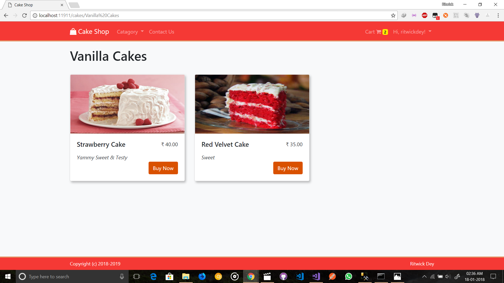
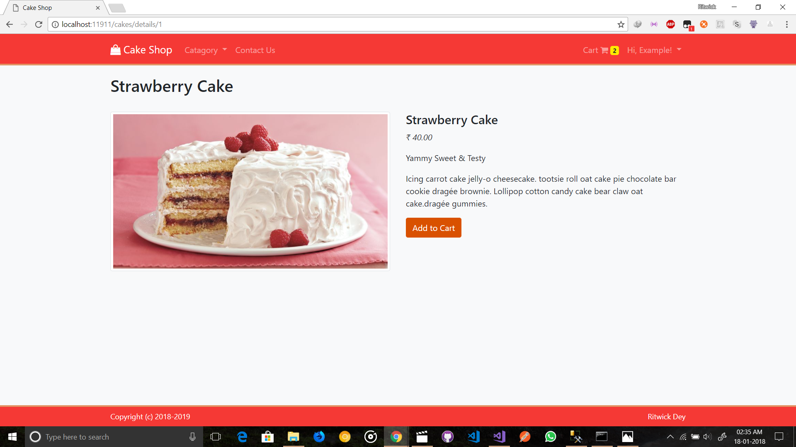
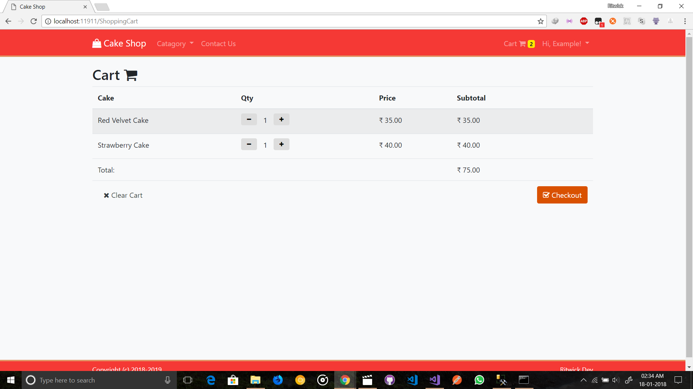

# Cake Shop

A sample Cake Shop Website built with ASP.NET Core (Multi-Page Application)


## APP/Code Features 
- Only Admin can perform Create/Edit/Delete cakes & manage Orders.
- Normal User can only can buy cakes & view their orders.
- Managing Cart System using cookie.
- Client Side & Server side validation,
- Cookie Based Authentication & Authorization - Not Session
- Login through either `Username` or `Email`.
- Responsive UI
- Repository Pattern 
- Application Architecture is decoupled form ORM (Entity Framework)

## Framework / Library 
- ASP.NET Core 2.0 *(Backend)*
- Razor View Engine *(For generating markup)*
- Entity Framework Core *(ORM)*
- ASP.NET Identity *(Cookie Based Authentication & Authorization - Not Session)*
- AutoMapper *(For mapping into Domain Model & DTO)*
- jQuery & Bootstap 4

## To run the project locally:
   > admin account : `admin@admin.com` and Password: `Passw@rd!123` (You can change it from `appsettings.json` before apply `update database`)

   > Make sure, dotnet core SDK & npm is installed in your machine.

- **Using VS2017**
     ``` 
       > git clone https://github.com/ritwickdey/Cake-Shop.git
       > cd Cake-Shop/
    ```
    - Now Open the `CakeShop.sln` through `VS2017`.
    - Open `appsettings.json` & change the connection string. (But wait! you may not need to change it as this the default connection string of `SQL Server Express` that comes with `Visual Studio`).
    - Hit `Ctrl+Shift+B` to build.
    - Open `Package Manager Console` from `Tools` and enter `update-database`.
    - Hit `Ctrl+F5` to run without debugging.

- **Using CLI**
    ```
        > git clone https://github.com/ritwickdey/Cake-Shop.git
        > cd Cake-Shop/Cake-Shop/
        > npm install
        > dotnet restore
        > set ASPNETCORE_ENVIRONMENT=Development
        > set ConnectionStrings:DefaultConnection="<YOUR CONNECTION STRING>"
        > npm i webpack -g
        > webpack --config webpack.config.js
        > npm run build
        > dotnet build 
        > dotnet ef database update
        > dotnet run 
    ```

## Sceenshots





